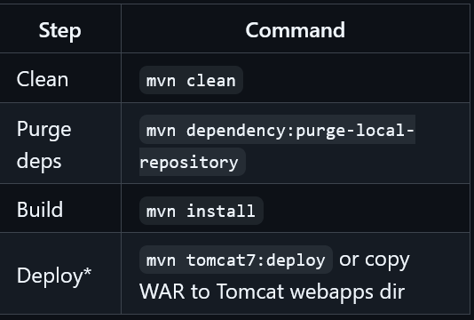

# Jakarta-submit

A role-based submission web application built using **Jakarta EE (Servlets, JSP, JSTL, EL)**, styled with **Bootstrap**, and powered by **PostgreSQL** for persistent storage.  
This project implements **RBAC (Role-Based Access Control)** to manage different user roles: **Admin**, **Student**, and **Instructor**.

---

## Tech Stack

- **Java (Servlet, JSP, JSTL, EL)**
- **Bootstrap** – for responsive UI design
- **PostgreSQL** – for database management
- **Jakarta EE** – for web architecture (Servlets)

---

## Features

- User **Signup** and **Login**
- **Role-Based Access Control (RBAC)**:
  - **Admin** – Manage users and system roles
  - **Student** – Submit assignments and view feedback
  - **Instructor** – Grade submissions and manage tasks

---

## Configure bootstrap

- download (click first button) bootstrap css/js bundles from [bootstrap css/js](https://getbootstrap.com/docs/5.3/getting-started/download)
- extract the .zip
- create "resources/bootstrap" folders into src/main/webapp/
- move the css/js folders to the created bootstrap directory
- You're done.

---

## Run the Web App

### General Running Maven Commands and Tomcat Configuration Panel



```sh
mvn clean
mvn dependency:purge-local-repository
mvn install
mvn package
py deploy_script.py
```

Then access **localhost:5005/Jakarta-Submit-1.0-SNAPSHOT** and make sure Tomcat has been run from the Tomcat configuration panel.  
Consider changing the Tomcat port number; currently, **5005** is being used.

---

### Running the Web App from Tomcat Server IntelliJ Plugin

  
  


1. **Configure Artifacts:**

   - Project Structure → Artifacts → Web Application: Exploded → From Modules → Select your project’s module/name
   - Apply → OK

2. **Make sure Tomcat is configured in Project Structure:**

   - Project's SDK (e.g., `C:\Program Files\Apache Software Foundation\Tomcat 11.0`)

3. **Add Tomcat Server:**

   - Press `ALT + SHIFT + F10` → Add Tomcat Server "Local" (not TomEE)

4. **Set the Application Context:**

   - Set to Tomcat base path (same as project's SDK)
   - URL: `http://localhost:5005/Jakarta_Submit_war_exploded`
   - JRE: `C:\Program Files\JAVA\BellSoft\LibericaJDK-21-Full`
   - HTTP PORT: **5005**
   - JMX PORT: **1717** (1099 already in use by IntelliJ JMX)

5. **Configure Deployment:**
   - Under Deployment panel: Delete all artifacts, add one set from artifact project structure (`Jakarta-Submit:war exploded`)
   - Set the application context: `/Jakarta_Submit_war_exploded`
   - Apply → OK/Run

You’ll be redirected to the web browser app at: `http://localhost:5005/Jakarta_Submit_war_exploded`

---

## Let's Connect and Follow Each Other

**Mchiir**  
[mugishachrispin590@gmail.com](mailto:mugishachrispin590@gmail.com)  
[GitHub – @Mchiir](https://github.com/Mchiir)

---

## Contributing

Pull requests are welcome!  
Feel free to fork the repository and submit a PR to enhance features or fix bugs.
